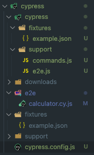

## Cypress

### 테스트의 종류

- `End-to-End(E2E) 테스트` : 사용자의 관점에서 테스트를 수행하는 것
- `Integration 테스트` : 서로 다른 컴포넌트 간의 통합 테스트를 수행하는 것
- `Unit 테스트` : 최소 단위의 코드를 테스트하는 것

### Cypress란?
- 웹 애플리케이션을 테스트하기 위한 `자바스크립트 E2E 테스트 프레임워크`(Unit, integration, E2E 테스트를 모두 지원)
- 개발을 진행하면서 표현되는 모든 화면의 테스트를 수행하고, 브라우저를 통해 결과를 확인할 수 있음

### Cypress의 특징

- `실시간 리로딩` : 코드를 수정하면 자동으로 리로딩
- `GUI 인터페이스` : 각 단계마다 스냅샷을 찍어주기 때문에, 테스트를 진행하면서 어떤 단계에서 오류가 발생했는지 GUI인터페이스를 통해 직관적으로 확인 가능
- `브라우저에서 테스트` : 브라우저에서 테스트를 진행하기 때문에, 실제 사용자가 사용하는 환경과 동일한 환경에서 테스트를 진행할 수 있음.

### 설치 및 실행

```bash
 npm i cypress --save-dev
```
```bash
 npx cypress open
```
- node나 npm이 설치되어 있지 않다면 프로그램을 설치 후 실행

### 폴더 구조



- `fixtures` : 테스트에 필요한 정적 파일을 저장하는 폴더
- `E2E` : 테스트 코드를 저장하는 폴더
- `support` : 테스트 코드에서 사용하는 공통 모듈을 저장하는 폴더
- `cypress.config.json` : Cypress 설정 파일로, 여러 테스트 옵션을 지정가능

### 테스트 코드 작성

```js
describe('테스트 그룹 설명, 상세', () => {
  context('테스트', () => {
    it('테스트 상세', () => {
      // 테스트 코드
    })
  })
})
```

#### 웹사이트 방문

```js
describe('테스트 그룹 설명, 상세', () => {
  context('테스트', () => {
    it('사이트에 접속한다.', () => {
      cy.visit('https://example.cypress.io')
    })
  })
})
```

- 특정 웹 사이트에 대해 테스트를 작성하려면, 기본적으로 해당 웹을 방문해야한다. 
- cypress에서는 `cy.visit()` 메서드를 통해 웹 사이트에 접속할 수 있다.

```js
describe('테스트 그룹 설명, 상세', () => {
  beforeEach('사이트에 접속한다.', () => {
    cy.visit('https://example.cypress.io');
  });

  context('테스트', () => {
    it('특정 버튼을 클릭한다.', () => {
      cy.get('.home-list');
        .contains('type');
        .click();
    })
  })
})
```

- `beforeEach()` 메서드를 통해 테스트 코드를 실행하기 전에 모든 하위 테스트 이전에 수행할 사전 작업을 정의할 수 있다.
- `cy.get()` 메서드를 통해 특정 요소를 선택할 수 있다. 동일한 요소가 있을 경우, 어트리뷰트를 통해 선택할 수 있다.(ex. `cy.get('[data-cy=btn]')`)
- `cy.contains()` 메서드를 통해 특정 요소의 텍스트를 선택할 수 있다.
- `cy.click()` 메서드를 통해 특정 요소를 클릭할 수 있다.


#### 기타 메서드

- `cy.should()` : 특정 요소의 값을 판단할 수 있다.
- `cy.server()` : 서버를 생성할 수 있다.
- `cy.route()` : 서버의 api를 호출할 수 있다.
- `cy.wait()` : 특정 동작을 기다릴 수 있다.
- `cy.invoke()` : 특정 요소의 메서드를 호출할 수 있다.
- `cy.next()` : 이전 동작이 완료되길 기다린다.

- 기타 문법은 아래의 공식문서를 참조

#### 한계점

- 동시에 두 개 이상의 브라우저를 테스트할 수 없다.
- 카카오페이, 토스결제 등 외부 모듈을 테스트을 거쳐야하는 프로세스는 테스트가 불가능하다. 
- 유닛테스트에 비해 작성시간이 다소 오래걸릴 수 있다.

### 참고자료

- [Cypress 공식문서](https://docs.cypress.io/guides/overview/why-cypress.html#In-a-nutshell)
- [Cypress 101-1](https://velog.io/@jay/Cypress-1)
- [React X Cypress 테스트 기초 셋팅 및 가이드](https://danawalab.github.io/common/2021/07/14/Cypress-Usage.html)
- [Cypress를 활용한 React 테스팅](https://tecoble.techcourse.co.kr/post/2021-07-28-react-cypress-testing/)